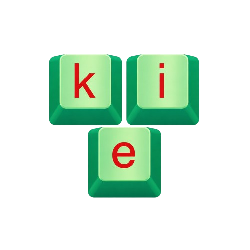

# KieeKey

[](LICENSE)


**KieeKey v1.1.0** is a modern, low-latency Vietnamese input method engine
(bộ gõ Tiếng Việt) for Windows, with a system-tray application, a TSF
text-store composer and an optional WinUI 3 Fluent settings UI.

> **KieeKey is a modified version based on
> [OpenKey](https://github.com/tuyenvm/OpenKey)** by Tuyen Mai (GPL-3.0).
> The original C++11/Win32 engine of OpenKey 2.0.5 was fully ported to
> modern C++, refactored and hardened. KieeKey inherits the **GNU General
> Public License v3.0** in its entirety and keeps upstream attribution in
> every source file.



---

## Highlights

* **Correct Vietnamese output** — Telex, VNI and Simple-Telex, with the
  upstream tone-mark fix carried in (golden test: `"as"` → `"á"`).
* **Low latency by design** — asynchronous low-level keyboard hook feeding a
  lock-free Vyukov SPSC ring; the hook callback never blocks and returns in
  O(1). Deep E2E latency audit included ([docs/reports/LATENCY_AUDIT_REPORT.md](docs/reports/LATENCY_AUDIT_REPORT.md)).
* **Modern TSF composer** — commits text through the Text Services Framework
  text store, no synthetic backspaces.
* **Event-driven app awareness** — foreground-process monitor with
  auto-exclusion of games/apps that dislike IMEs (and of KieeKey's own
  windows, so it never eats the keys you type into its own settings).
* **Familiar tray UX** — green/gray tray icon, left-click status menu,
  Vietnamese settings dialog, Ctrl+Shift global toggle with an optional
  on/off confirmation balloon (same defaults as upstream).
* **Per-app output policy** — TSF for browsers and Office/WPS (no character
  flicker), inline `SendInput` everywhere else (lowest latency); the
  foreground app's responsiveness is probed before TSF is trusted, so a hung
  target can never stall the hook.
* **HiDPI-ready** — PerMonitorV2-aware settings dialog laid out on a 96-dpi
  design grid and re-scaled on `WM_DPICHANGED`, so it is crisp and unclipped
  at 125/150/200 %.

## What KieeKey changes compared to OpenKey

| Area | OpenKey 2.0.5 (upstream) | KieeKey v1.1.0 |
|---|---|---|
| Language level | C++11 / Win32 | C++20/23 (per-instance state machine, constexpr, RAII) |
| Input pipeline | Synchronous processing in hook callbacks | Async hook thread → lock-free ring → consumer thread |
| Text insertion | Backspace-driven editing | TSF text-store composer (single-edit fast path) |
| Phonetics data | `std::map`/`std::vector` built at runtime | Generated flat tables (`tools/gen_flat_tables.py`) for cache-friendly lookups |
| Resource handling | Manual HANDLE/registry lifecycle | RAII wrappers (`Win32RAII.hpp`) |
| Testing | Manual QA | Golden vectors + stress/soak/fuzz suites + 3-way differential vs a clean-room oracle and vendored engines (~5.97M cases, [docs/reports/MEGA_BENCH_REPORT.md](docs/reports/MEGA_BENCH_REPORT.md)) |
| Latency engineering | — | Instrumented tone-mark path, event-driven ordering barrier, p50–p99.9 percentile benches ([docs/reports/LATENCY_AUDIT_REPORT.md](docs/reports/LATENCY_AUDIT_REPORT.md)) |
| CI/CD | — | GitHub Actions matrix: x64 + ARM64 + ARM64EC, unit tests (ctest) on the native-arch x64 job, on every push |

> KieeKey keeps the engine algorithm faithful to upstream (1:1 phonetics
> tables) — the refactor targets architecture, latency and testability, not
> behavior changes. The full engineering history (15 verbatim lineage
> reports, written under the pre-release working name "OpenKey NextGen")
> is preserved in [docs/reports/](docs/reports/README.md).

## Architecture

```
WH_KEYBOARD_LL / WH_MOUSE_LL          (hook thread, serialized)
        │  try_push — O(1), allocation-free
        ▼
LockFreeQueue (Vyukov SPSC ring)
        │  drain
        ▼
TextEngine  ── Telex / VNI / Simple-Telex state machine (flat tables)
        │  OutputItem (backspace count + UTF-16 payload)
        ▼
TsfComposer ── TSF text-store commits (zero-alloc single-edit fast path)
        │
        ├── ProcessMonitor ── foreground app detection + auto-exclusion
        └── Win32 tray app (KieeKeyApp.exe) + optional WinUI 3 settings UI
```

Source layout: `src/core` (engine + queue + RAII + tables), `src/tsf`
(composer), `src/app` (Win32 tray app + resources), `src/ui` (WinUI 3
Fluent settings), `tests` (unit/stress/bench harnesses + vendored
reference engines), `tools` (table generators), `demo` (interactive
console demo).

## Building

Requirements: **Windows 10/11**, **Visual Studio 2022** (Desktop C++),
**CMake ≥ 3.28**, Windows App SDK (only for the optional WinUI 3 UI).

```bat
:: configure (x64 Release, WinUI 3 UI + tests)
cmake --preset x64-release

:: build
cmake --build --preset x64-release

:: run the unit tests via CTest
ctest --preset x64-release
```

Presets available: `x64-debug`, `x64-release`, `arm64-release` (see
`CMakePresets.json`). A MinGW-w64 toolchain file is provided at
`cmake/mingw-w64-x86_64.cmake` for console/engine-only builds. CI builds
both targets on every push via `.github/workflows/build.yml`; tagged commits
additionally produce downloadable release artifacts — prebuilt binaries are
**not** committed to this repository (see `bin/README.txt`). The optional
WinUI 3 front-end is not built in CI (it needs the Windows App SDK NuGet
package restored locally).

## Repository layout

```
KieeKey/
├── LICENSE                     GNU GPLv3 (verbatim)
├── README.md                   this file
├── THIRD-PARTY-NOTICES.md      upstream licenses & compliance notes
├── CHANGELOG.md                release history
├── CMakeLists.txt / CMakePresets.json / cmake/
├── .github/workflows/build.yml CI matrix (x64/ARM64)
├── docs/reports/               15 verbatim lineage engineering reports (+ index)
├── src/                        core engine, TSF composer, tray app, WinUI 3
├── tests/                      unit / stress / bench + vendored references
├── tools/                      flat-table generators
├── imebench_kit/               3-way benchmark harness (results regenerated locally)
├── demo/                       interactive console demo
├── scripts/                    engine probe programs
└── bin/                        build-output placeholder (see bin/README.txt)
```

## License

KieeKey — Copyright (C) 2026 coderunknow - https://github.com/coderunknow.

This program is **free software**: you can redistribute it and/or modify it
under the terms of the **GNU General Public License as published by the
Free Software Foundation, either version 3 of the License, or (at your
option) any later version** — see the [LICENSE](LICENSE) file.

This program is distributed in the hope that it will be useful, but WITHOUT
ANY WARRANTY; without even the implied warranty of MERCHANTABILITY or
FITNESS FOR A PARTICULAR PURPOSE. See the GNU General Public License for
more details.

KieeKey is a modified version based on OpenKey — Copyright (C) 2019
Tuyen Mai — which is licensed under GPL-3.0; KieeKey inherits that license
in full. Third-party reference sources are vendored verbatim under their
original licenses — see [THIRD-PARTY-NOTICES.md](THIRD-PARTY-NOTICES.md).

## Acknowledgements

* **[OpenKey](https://github.com/tuyenvm/OpenKey)** by **Tuyen Mai** — the
  upstream project KieeKey is based on. KieeKey would not exist without the
  original engine, its phonetics tables and its years of real-world
  refinement. Xin cảm ơn!
* **[UniKey](https://www.unikey.org)** by **Pham Kim Long** — vendored as a
  reference engine used by the differential-test harness to cross-validate
  correctness (LGPL; original headers preserved).
* The Vietnamese free-software community, whose feedback shaped both
  upstream projects.

---

## Tóm tắt (Tiếng Việt)

**KieeKey v1.1.0** là bộ gõ Tiếng Việt cho Windows, được xây dựng dựa trên
dự án **[OpenKey](https://github.com/tuyenvm/OpenKey)** (GPL-3.0) của tác
giả Tuyen Mai. Toàn bộ engine gốc đã được port sang C++ hiện đại, refactor
và hoàn thiện logic: pipeline hook bất đồng bộ với hàng đợi lock-free,
composer TSF không dùng backspace ảo, bảng âm tiết dạng flat tối ưu cache,
cùng bộ test vi mô + đo hiệu năng + đối chiếu sai khác quy mô hàng triệu
trường hợp.

KieeKey phát hành mã nguồn mở theo **Giấy phép GNU GPLv3** (kế thừa trọn
vẹn từ OpenKey). Thông tin bản quyền của tác giả gốc được giữ lại trong
đầu mỗi file nguồn; mã nguồn tham chiếu của OpenKey 2.0.5 và UniKey được
giữ nguyên văn trong `tests/reference/` với giấy phép gốc của chúng — chi
tiết tại [THIRD-PARTY-NOTICES.md](THIRD-PARTY-NOTICES.md).
